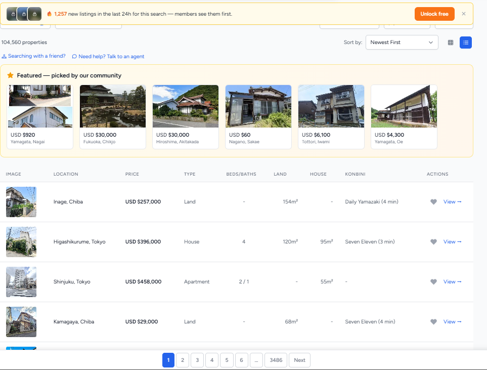
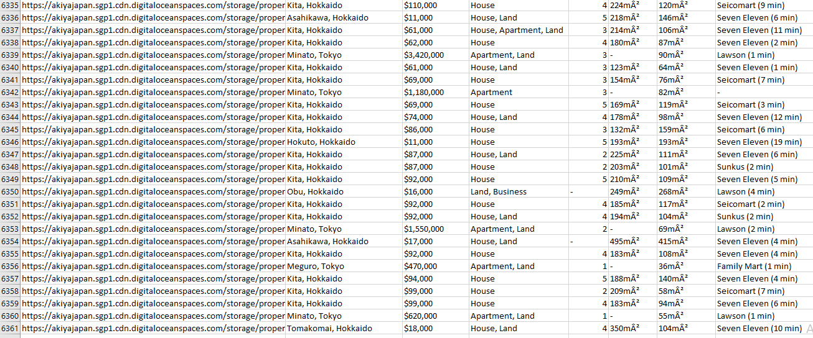
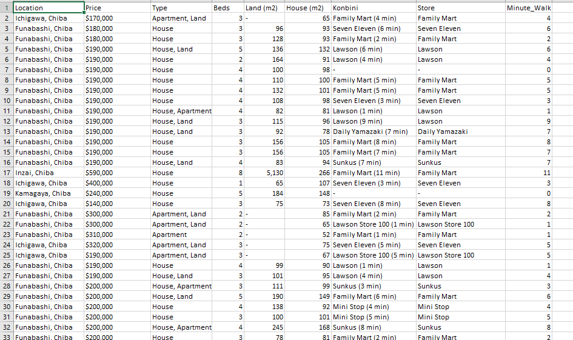
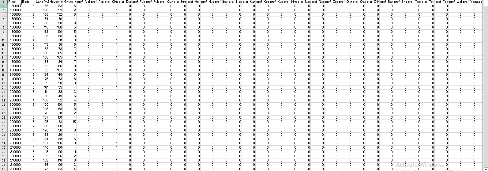

# Akiya_Project

A data pipeline that scrapes, cleans, and models pricing data for **akiya** (vacant houses) listed for sale across Japan.

## Overview
This project demonstrates an end-to-end data workflow:
1. **Web scraping** — collected 6,000+ property listings (price, location, land/house size, nearest convenience store, walking distance)
2. **Data cleaning** — converted currency strings to numeric values, split combined text fields (e.g. "Family Mart (4 min)") into separate columns, handled missing values
3. **Feature engineering** — one-hot encoded prefecture data for modeling
4. **Price prediction** — built a regression model to estimate property price based on location and property features

## Process

### 1. Source
Scraped listings from akiyajapan.com.

### 2. Raw scraped data

### 3. Cleaned data
Split combined fields, handled missing values, converted price to numeric.

### 4. Feature-engineered data (for modeling)

## Files
- `1_scraping.ipynb` — scraping logic
- `2_cleaning.ipynb` — data cleaning steps
- `3_price_prediction.py` — regression model

## Tech stack
Python, pandas, BeautifulSoup/Selenium (specify which), scikit-learn
